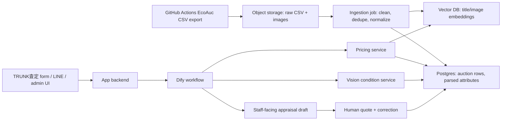

# Luxury Price AI Flow

## Goal

Build a photo-first luxury appraisal assistant for TRUNK-style online査定. A customer submits item photos and basic metadata, and the system returns an estimated purchase-price range, comparable auction examples, confidence, and reasons a human appraiser can review before sending the official quote.

TRUNK's current site promises simple online査定 from a few photos, broad luxury categories, and usually a 1-2 business day response. The AI flow should support that workflow, not replace final expert judgment.

## Recommendation

Use Dify as the workflow/orchestration layer, but do not make Dify the core pricing model.

Dify is useful for:

- Intake flow: collect brand, category, photos, free-text notes, accessories, serial/card status, and user intent.
- LLM reasoning: normalize messy Japanese/English descriptions, produce査定理由, ask follow-up questions, and format staff-facing output.
- RAG: retrieve internal appraisal guidelines, brand notes, and policy documents.
- API/web app publishing: expose the workflow to the TRUNK site or internal admin UI.
- Tool calling: call our own pricing API and image-condition API.

Keep outside Dify:

- Auction CSV ingestion and cleansing.
- Similar-item search over structured fields and embeddings.
- Statistical price estimation.
- Image download/storage and image embeddings.
- Model training/evaluation.
- Audit logs and human correction data.

This hybrid keeps the high-risk math testable and versioned while still letting the business iterate quickly on the appraisal conversation.

## Data We Have

The sample artifact `/Users/min/Downloads/ecoauc-export-27178494880-chanel.zip` contains `CHANEL-2026-01-2026-05-bags.csv`.

Observed shape:

- Rows: 16,082 sold CHANEL bag records.
- Columns: `month`, `brandQuery`, `itemId`, `itemUrl`, `soldDate`, `brand`, `title`, `rank`, `category`, `shape`, `priceJpy`, `auction`, `imageUrl`.
- Price distribution: min 200 JPY, median 142,000 JPY, average 192,697 JPY, p90 430,000 JPY, max 4,257,000 JPY.
- Condition/rank distribution: mostly `B`, then `BC`, `AB`, `A`, with smaller `C`, `F`, `S`, `D`, `N`.
- Common shapes: `ショルダーバッグ`, `トートバッグ`, `ハンドバッグ`, `バッグ`, `ポーチ`, `バニティバッグ`.

This is enough to build an MVP for CHANEL bags using structured similarity and comparable sales. It is not yet enough to reliably train an image-only condition model across all brands/categories.

## Proposed Architecture



## MVP Flow

1. Customer uploads photos and enters category/brand if known.
2. Dify normalizes the request:
   - brand: `CHANEL`
   - category: `バッグ`
   - shape: candidate such as `ショルダーバッグ`
   - material/color/model keywords from text and image captions.
3. Vision model extracts visible attributes:
   - product type, dominant color, material hints, hardware color, visible damage, photo quality.
   - condition estimate as a soft label, not final truth.
4. Pricing API retrieves comparable EcoAuc sales:
   - same brand/category/shape/rank where possible.
   - title embedding similarity for model names like `マトラッセ`, `ココハンドル`, `ボーイ`, `チェーンウォレット`.
   - recency weighting by `soldDate`.
5. Pricing API returns:
   - comparable sales table.
   - wholesale auction estimate.
   - suggested purchase range after margin/risk rules.
   - confidence score and missing-data flags.
6. Dify creates an appraiser-readable draft:
   - estimated price range.
   - top comparable examples with links.
   - rationale.
   - questions to ask when confidence is low.
7. Human appraiser accepts/edits the quote. Store the correction for future model evaluation.

## Pricing Model Stages

### Stage 1: No Training

Start with robust retrieval and statistics:

- Filter by brand/category/shape.
- Parse title tokens for known model/material/color/accessory words.
- Weight by recency, rank similarity, and text similarity.
- Use median and percentile ranges, not a single point estimate.
- Apply business margin rules separately from market price.

This can ship fastest and is explainable.

### Stage 2: Tabular Model

Train a regression model once data covers enough brands/categories:

- Target: `log(priceJpy)`.
- Features: brand, category, shape, rank, month, parsed model/material/color, title embeddings, image embeddings.
- Baselines: LightGBM/CatBoost/XGBoost plus quantile regression for ranges.
- Metrics: median absolute percentage error, within-20-percent accuracy, rank/category sliced error.

### Stage 3: Image Condition Model

Use EcoAuc `rank` as weak labels:

- Download and store image URLs while allowed and available.
- Generate embeddings with CLIP/SigLIP or a vision LLM.
- Train image-to-rank classifier or image embedding + tabular fusion model.
- Treat output as condition evidence, not final condition. Auction ranks are noisy and one 220x160 image often misses corners/interior damage.

Japanese note: Ecoring/EcoAucの画像データを数値化して状態判定に使う方針は現実的です。ただし最初から「画像だけで査定額」ではなく、画像ベクトル + 商品名/ブランド/形状/rank/落札価格を組み合わせる方が精度と説明性が出ます。

## Dify App Design

Recommended Dify workflow nodes:

- Start: `brand`, `category`, `description`, `photos`, optional `desired_speed`.
- LLM extraction: normalize brand/category/model/material/color/accessories.
- Vision LLM: inspect photos and output structured JSON.
- HTTP tool: call `/price-estimate`.
- Knowledge retrieval: appraisal policies, prohibited categories, margin rules, copy templates.
- LLM finalizer: produce staff draft and customer-safe summary.
- Conditional branch:
  - high confidence: draft price range.
  - low confidence: ask for missing photos/details.
  - suspicious/authenticity risk: route to expert review.

Do not upload every auction row as plain Dify knowledge chunks for pricing. RAG is good for textual policy and comparable explanations, but numeric price estimation should query a database/vector index directly.

## Pricing API Contract

Example request:

```json
{
  "brand": "CHANEL",
  "category": "バッグ",
  "shape": "ショルダーバッグ",
  "title_keywords": ["マトラッセ", "キャビアスキン", "黒", "ゴールド金具"],
  "condition_rank_guess": "AB",
  "image_embedding_ids": ["img_123"],
  "sold_after": "2025-01-01",
  "limit": 20
}
```

Example response:

```json
{
  "market_price_jpy": {
    "low": 280000,
    "mid": 360000,
    "high": 450000
  },
  "purchase_offer_jpy": {
    "low": 210000,
    "mid": 270000,
    "high": 300000
  },
  "confidence": 0.72,
  "missing_inputs": ["interior photo", "corner photos"],
  "comparables": [
    {
      "item_id": "8708560",
      "sold_date": "2026-01-30",
      "title": "CHANEL マトラッセ チェーン ショルダーバッグ",
      "rank": "AB",
      "price_jpy": 151000,
      "item_url": "https://www.ecoauc.com/client/market-prices/view/8708560"
    }
  ]
}
```

## Immediate Next Steps

1. Build ingestion in this repo:
   - unzip GitHub Action artifacts.
   - load CSV rows into Postgres or SQLite for MVP.
   - normalize rank, price, sold date, category, shape.
2. Add title parsing:
   - brand-specific model dictionary for CHANEL/LV/Hermes.
   - Japanese material/color/hardware/accessory tokens.
3. Create `/price-estimate` endpoint:
   - comparable retrieval.
   - percentile range.
   - confidence and missing-input flags.
4. Configure a Dify workflow:
   - front the pricing endpoint with LLM extraction and final wording.
5. Add image processing:
   - persist EcoAuc image URLs/images.
   - generate image embeddings.
   - compare uploaded item photos to historical images.
6. Evaluate with human appraiser feedback:
   - quote accepted/edited.
   - final purchase price.
   - reason for override.

## Sources Checked

- TRUNK public site: photo-based online appraisal, categories, and response promise.
- Dify docs: Dify is an open-source platform for agentic workflows; it supports knowledge/RAG and exposing apps through APIs.
- Sample EcoAuc CHANEL bags export: 16,082 rows, January-May 2026.
